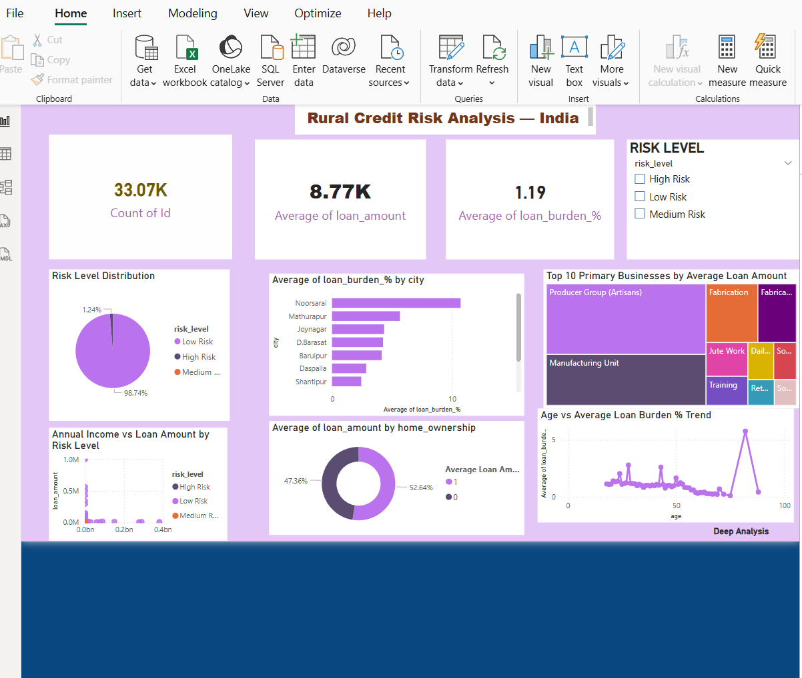
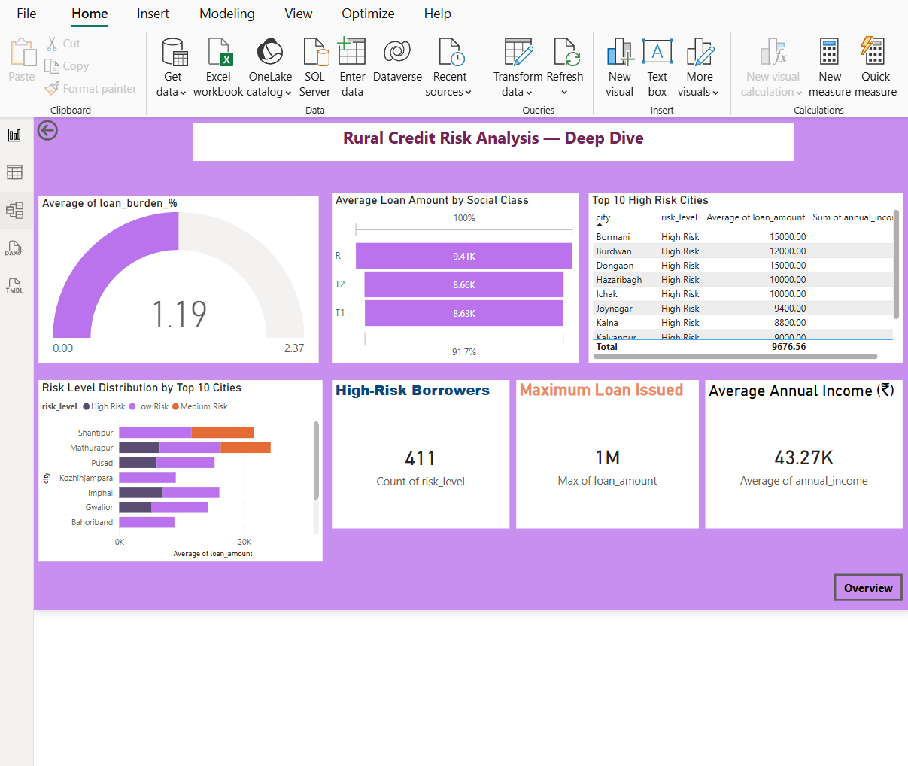

# Rural Credit Risk Analysis — India

## About This Project
I analyzed 40,000 rural loan records from India to help banks
identify which borrowers, cities and businesses have the highest
risk of not repaying their loans.

## Tools Used
- Python — data cleaning and charts
- SQL — business queries in DBeaver
- Excel — pivot tables and charts
- Power BI — interactive dashboard

## Dataset
- Source: Kaggle — Rural Credit Data India
- Total Records: 40,000
- After Cleaning: 33,065 records

## What I Found
1. Noorsaray city has 60% loan burden — highest in dataset
2. 411 farmers are High Risk borrowers
3. Producer Group Artisans need ₹5 lakh — highest loan amount
4. T1 house farmers have highest financial stress
5. Manufacturing businesses need ₹3.6 lakh on average

## Business Recommendations
1. Restructure loans for Noorsaray farmers immediately
2. Create separate loan category for Producer Groups above ₹3 lakh
3. Use house type as risk indicator during loan approval
4. Fast track micro loan approval below ₹1 lakh
5. Focus recovery team on top 10 high risk cities

## Dashboard Screenshots
### Page 1 — Overview

### Page 2 — Deep Analysis

## About Me
- BTech CSE 2027 Batch
- Skills: Python, SQL, Excel, Power BI
- Location: Hyderabad, India
  
